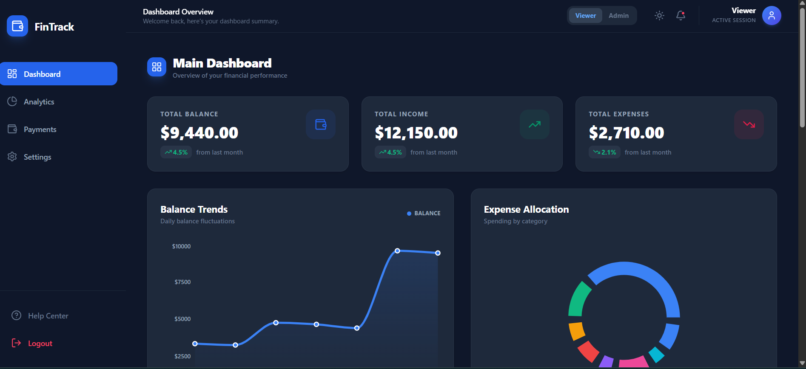
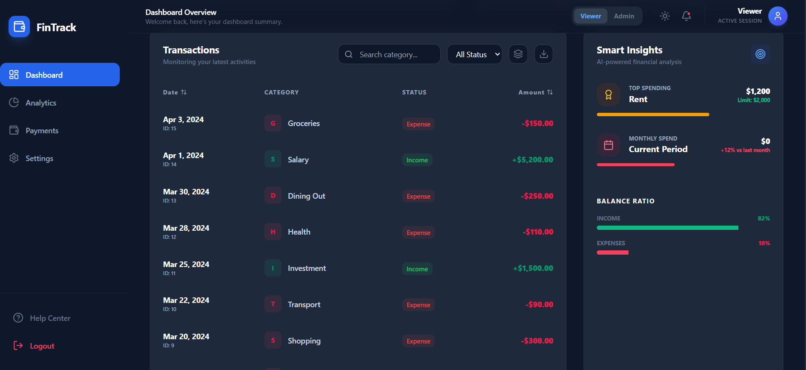
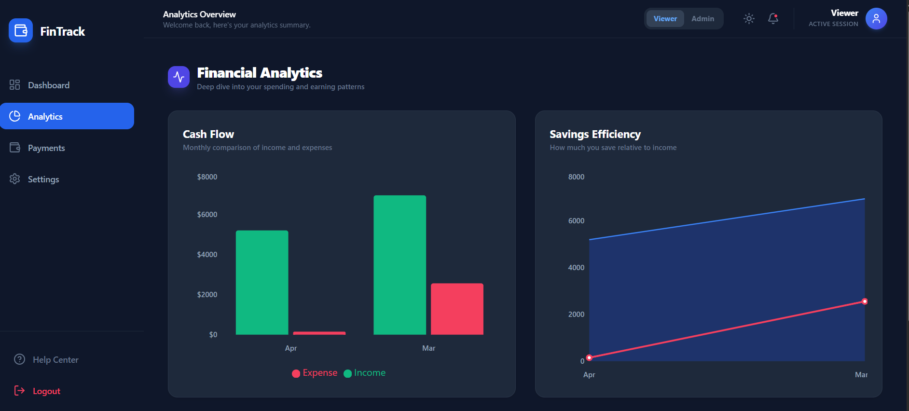
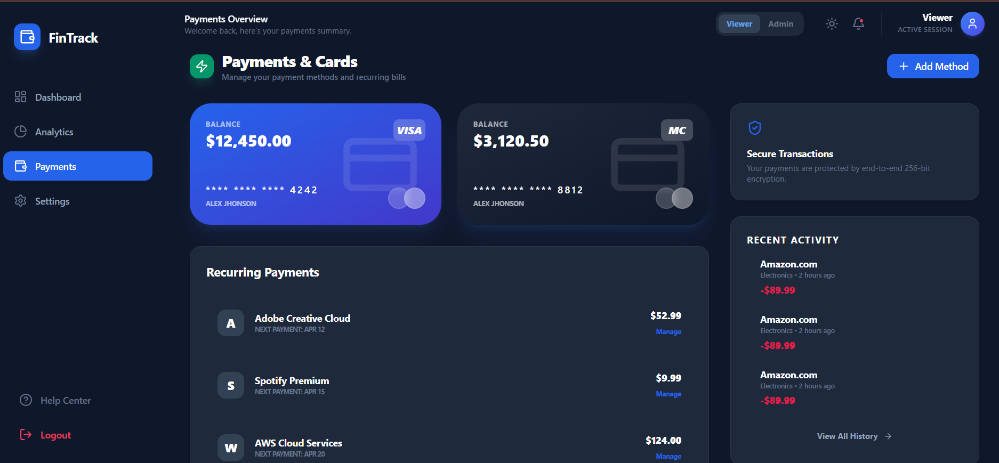
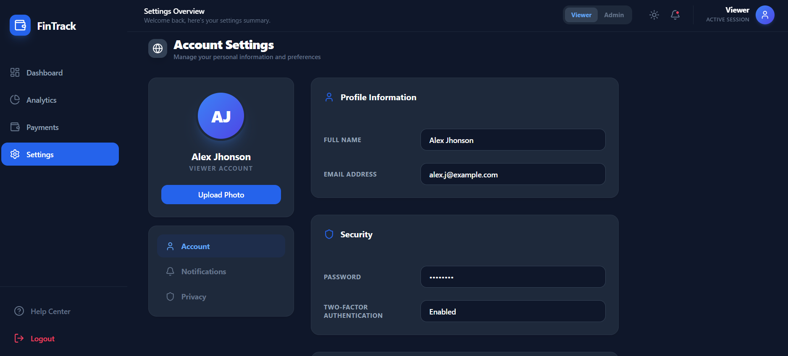

# 💳 FinTrack - Professional Finance Dashboard UI

FinTrack is a high-performance, visually stunning, and interactive finance management dashboard. Built with **React**, **Tailwind CSS**, and **Recharts**, it offers a seamless experience for tracking balances, analyzing spending patterns, and managing virtual assets.

---

## 🌟 Key Features

---

## 📸 Preview

### 🌗 Dark Mode Overview
| Dashboard Summary | Transactions & Insights |
| :---: | :---: |
|  |  |

### 📈 Multi-View Interface
| Financial Analytics | Payments & Virtual Cards | Account Settings |
| :---: | :---: | :---: |
|  |  |  |

---

## 📊 Comprehensive Dashboard
- **Real-time Metrics**: Instant overview of Total Balance, Income, and Expenses with trend indicators.
- **Dynamic Visualizations**: 
  - **Balance Trends**: Interactive Area Chart tracking historical fluctuations.
  - **Expense Allocation**: Donut Chart providing a granular breakdown of spending categories.
- **Smart Insights**: AI-simulated analysis highlighting top spending categories and monthly efficiency.

### 💸 Advanced Transaction Management
- **Full CRUD**: Add and delete transactions (Admin role).
- **Power Search & Filter**: Instant filtering by category and transaction type.
- **Advanced Sorting**: Order data by date or amount with a single click.
- **[NEW] Data Export**: Export your financial data to **CSV** or **JSON** for external use.
- **[NEW] Categorical Grouping**: Toggle specialized grouping to organize your ledger visually.

### 🔐 Role-Based Interface (Simulated)
- **Viewer**: Read-only access to all charts and data.
- **Admin**: Full control over transaction entry and management.
- **Seamless Switching**: Toggle roles instantly via the navigation bar.

### 📈 Analytics, Payments & Settings
- **Deep-Dive Analytics**: Side-by-side cash flow comparisons and savings efficiency metrics.
- **Virtual Wallet**: Glassmorphism-styled credit card management and subscription tracking.
- **Global Settings**: Profile management, security toggles, and theme preferences.

### 🌗 Premium UI/UX
- **Modern Aesthetic**: Slate-based professional palette with vibrant semantic colors.
- **Responsive Architecture**: Fluid layout that scales from mobile devices to ultra-wide monitors.
- **Dark Mode**: Fully integrated, system-wide dark theme.
- **Animations**: Smooth transitions and entry animations for a premium software feel.

---

## 🚀 Live Demo & Deployment

**[🔗 View Live Dashboard on Vercel](https://your-vercel-project-link.vercel.app/)**

### 📦 GitHub Repository
**[🔗 Source Code on GitHub](https://github.com/yourusername/finance-dashboard)**

---

## 🛠️ Technical Stack

- **Framework**: [React](https://reactjs.org/) (Vite)
- **Styling**: [Tailwind CSS](https://tailwindcss.com/)
- **Charts**: [Recharts](https://recharts.org/)
- **Icons**: [Lucide React](https://lucide.dev/)
- **State Management**: React Context API + Hooks
- **Persistence**: LocalStorage API

---

## 🚀 Getting Started

### Prerequisites
- Node.js (v18 or higher)
- npm or yarn

### Installation
1. **Clone the repository**:
   ```bash
   git clone https://github.com/yourusername/finance-dashboard.git
   ```
2. **Navigate to the directory**:
   ```bash
   cd finance-dashboard
   ```
3. **Install dependencies**:
   ```bash
   npm install
   ```
4. **Start the development server**:
   ```bash
   npm run dev
   ```
5. **Access the App**:
   Open `http://localhost:5173/` in your browser.

---

## 🎨 Design Principles
- **Clarity First**: Information-heavy sections use high-contrast typography and generous whitespace.
- **Semantic Feedback**: Income is always green, Expenses are always rose, ensuring intuitive data reading.
- **Performance**: Minimal re-renders and optimized chart components for a lag-free experience.

---

## 📝 Optional Enhancements Implemented
- ✅ **Dark Mode Toggle**
- ✅ **Data Persistence** (LocalStorage)
- ✅ **Mock API Integration** (Simulated Latency)
- ✅ **Advanced Data Export** (CSV/JSON)
- ✅ **Multi-View Navigation** (Analytics, Payments, Settings)
- ✅ **Grouping & Advanced Filtering**
